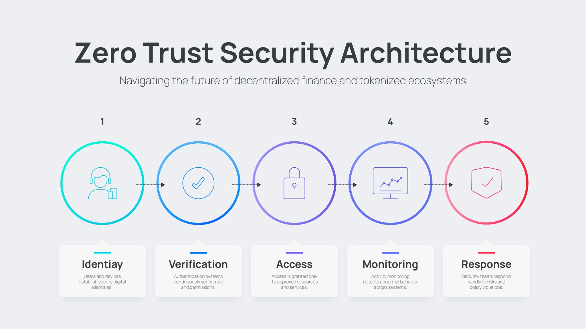
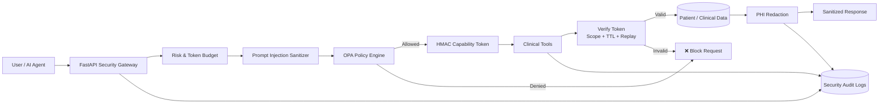

```markdown
# MedGuard Agent: Zero-Trust Security Framework for Clinical AI

**MedGuard Agent** is an open-source, production-grade security gateway and execution engine built to protect healthcare organizations from the unique vulnerabilities of **Agentic AI**.

While traditional web APIs rely on standard authentication (OAuth/JWT), AI agents introduce non-deterministic risks: prompt injections, unauthorized tool execution, cross-patient data exposure, and runaway API token consumption. MedGuard Agent sits between the client/user and underlying clinical tools, acting as a real-time **Policy Enforcement Point (PEP)** to guarantee zero-trust execution.

```

---

## 🎯 What This Project Solves

Deploying AI models in clinical environments requires strict adherence to privacy (HIPAA/GDPR) and system isolation. MedGuard Agent solves three critical security challenges:

1. **Prompt Injection & Jailbreaks:** Prevents malicious user prompts or external documents from overriding system instructions or coercing the agent into executing unauthorized tool calls.
2. **Over-Privileged Tool Delegation:** Replaces broad API keys with single-use, cryptographically signed capability tokens that restrict an agent's execution to a specific patient, tool, and time window.
3. **PHI Leaks & Session Abuse:** Scans outgoing tool outputs to redact Protected Health Information (PHI) and enforces hard rate/budget limits to prevent resource exhaustion.

---
## Architecture



### Request Flow

1. **Request:** A user or AI agent sends a request to the FastAPI security gateway.
2. **Risk Check:** The gateway checks request rate and token-budget limits.
3. **Sanitization:** Incoming prompts are checked for prompt-injection patterns.
4. **Authorization:** OPA evaluates the request against Rego security policies.
5. **Capability Token:** Approved requests receive a short-lived HMAC-SHA256 capability token scoped to the specific tool and patient.
6. **Tool Verification:** The clinical tool independently verifies the token, scope, expiry, and replay status.
7. **PHI Protection:** Clinical output is scanned and sensitive information is redacted before being returned.
8. **Audit:** Security events and tool activity are recorded in structured JSON audit logs.

**Core principle:** The AI agent is never trusted by default. Every tool request must be authenticated, authorized, scoped, verified, and audited before sensitive clinical actions are allowed.

## ⚙️ How MedGuard Agent Works

MedGuard Agent operates on a **Zero-Trust Policy Architecture**, separating policy enforcement from policy evaluation and tool execution.

```
+------------------+         +-------------------------------------------------+
|                  |         |                 FastAPI Security PEP            |
|                  |         |-------------------------------------------------|
|                  | (1) Req | 1. Velocity & Token Budget Check (RiskManager)  |
|   Client / User  | --------> 2. Prompt Injection Neutralization (Sanitizer) |
|                  |         | 3. OPA Policy Evaluation (Rego Decision)        |
|                  |         | 4. Single-Use Capability Token Generation       |
+------------------+         +------------------------+------------------------+
                                                      |
                                           (2) Validated Capability
                                                      |
                                                      v
                             +-------------------------------------------------+
                             |               Tool Execution Engine             |
                             |-------------------------------------------------|
                             | - Cryptographic Token Verification              |
                             | - Isolated Tool Execution (`get_patient_record`)|
                             | - Outbound PHI Redaction                        |
                             | - Structured JSON Audit Logging                 |
                             +-------------------------------------------------+

```

### The 6-Step Execution Flow

1. **Risk & Rate Verification:** When a request enters the gateway, the `RiskManager` evaluates session velocity to detect spam or automated abuse and checks the session token budget.
2. **Inbound Prompt Sanitization:** The input text is scrubbed for adversarial injection patterns (e.g., `ignore previous instructions`, `system: override`) before the prompt reaches any internal model or logic.
3. **Policy Decision Point (PDP):** The gateway forwards user claims, agent credentials, and request parameters to **Open Policy Agent (OPA)**. OPA evaluates Rego rules (`policies/authorization.rego`) to verify physician assignment and role-based permissions.
4. **Cryptographic Capability Delegation:** Upon policy approval, the gateway issues a single-use **HMAC SHA-256 Capability Token**. This token binds the agent, user, specific tool name, target patient ID, and a short Expiration Window (TTL).
5. **Isolated Tool Execution:** The clinical tool (e.g., `get_patient_record`, lab query, or appointment system) receives the capability token. It independently verifies the HMAC signature, ensures the token hasn't expired or been reused, and executes the action.
6. **Outbound PHI Redaction & Audit:** Before returning the tool result, the sanitization engine scrubs any exposed Protected Health Information (SSNs, DOBs, phone numbers, emails). Simultaneously, an immutable structured JSON log is emitted for regulatory compliance.

---

## 🧩 Core Components & Responsibilities

| Module | Location | Primary Responsibility |
| --- | --- | --- |
| **Security PEP Gateway** | `app/main.py` | FastAPI entrypoint handling ingress, orchestration, and API response formatting. |
| **OPA Policy Engine** | `policies/authorization.rego` | Rego rules enforcing role-based access control and patient-physician assignments. |
| **Capability Engine** | `app/security/capability.py` | HMAC SHA-256 token minting and cryptographic signature validation. |
| **Sanitization Engine** | `app/security/sanitization.py` | Dual-direction processor for inbound prompt injection scrubbing and outbound PHI redaction. |
| **Risk & Budget Manager** | `app/security/risk.py` | Tracks session velocity, call frequency, and token usage limits. |
| **Identity Verification** | `app/agent/identity.py` | Validates user identity claims and relationship checks against target domain entities. |
| **Structured Audit Logger** | `app/security/audit.py` | Generates standardized, machine-readable JSON security logs for audit trails. |
| **Clinical Tool Layer** | `app/tools/` | Isolated functional tools (patient records, lab results, appointments) with mandatory token verification. |

---

## 🛡️ Defenses & Security Guarantees

* **Zero Replay Attacks:** Capability tokens are single-use and expire within seconds (configurable TTL), preventing stolen token reuse.
* **Strict Scope Isolation:** An agent approved to read records for `Patient A` cannot execute commands against `Patient B`, even if manipulated by a prompt injection attack.
* **Fail-Closed Default:** If OPA is unreachable or any validation step fails, the gateway defaults to immediate request rejection.

---

## 📄 License

This project is licensed under the **MIT License**.

```

```Here is a `README.md` structured around **what MedGuard Agent is, why it exists, and how its security mechanism works under the hood**:

```markdown
# MedGuard Agent: Zero-Trust Security Framework for Clinical AI

**MedGuard Agent** is an open-source, production-grade security gateway and execution engine built to protect healthcare organizations from the unique vulnerabilities of **Agentic AI**.

While traditional web APIs rely on standard authentication (OAuth/JWT), AI agents introduce non-deterministic risks: prompt injections, unauthorized tool execution, cross-patient data exposure, and runaway API token consumption. MedGuard Agent sits between the client/user and underlying clinical tools, acting as a real-time **Policy Enforcement Point (PEP)** to guarantee zero-trust execution.

```

---

## 🎯 What This Project Solves

Deploying AI models in clinical environments requires strict adherence to privacy (HIPAA/GDPR) and system isolation. MedGuard Agent solves three critical security challenges:

1. **Prompt Injection & Jailbreaks:** Prevents malicious user prompts or external documents from overriding system instructions or coercing the agent into executing unauthorized tool calls.
2. **Over-Privileged Tool Delegation:** Replaces broad API keys with single-use, cryptographically signed capability tokens that restrict an agent's execution to a specific patient, tool, and time window.
3. **PHI Leaks & Session Abuse:** Scans outgoing tool outputs to redact Protected Health Information (PHI) and enforces hard rate/budget limits to prevent resource exhaustion.

---

## ⚙️ How MedGuard Agent Works

MedGuard Agent operates on a **Zero-Trust Policy Architecture**, separating policy enforcement from policy evaluation and tool execution.

```
+------------------+         +-------------------------------------------------+
|                  |         |                 FastAPI Security PEP            |
|                  |         |-------------------------------------------------|
|                  | (1) Req | 1. Velocity & Token Budget Check (RiskManager)  |
|   Client / User  | --------> 2. Prompt Injection Neutralization (Sanitizer) |
|                  |         | 3. OPA Policy Evaluation (Rego Decision)        |
|                  |         | 4. Single-Use Capability Token Generation       |
+------------------+         +------------------------+------------------------+
                                                      |
                                           (2) Validated Capability
                                                      |
                                                      v
                             +-------------------------------------------------+
                             |               Tool Execution Engine             |
                             |-------------------------------------------------|
                             | - Cryptographic Token Verification              |
                             | - Isolated Tool Execution (`get_patient_record`)|
                             | - Outbound PHI Redaction                        |
                             | - Structured JSON Audit Logging                 |
                             +-------------------------------------------------+

```

### The 6-Step Execution Flow

1. **Risk & Rate Verification:** When a request enters the gateway, the `RiskManager` evaluates session velocity to detect spam or automated abuse and checks the session token budget.
2. **Inbound Prompt Sanitization:** The input text is scrubbed for adversarial injection patterns (e.g., `ignore previous instructions`, `system: override`) before the prompt reaches any internal model or logic.
3. **Policy Decision Point (PDP):** The gateway forwards user claims, agent credentials, and request parameters to **Open Policy Agent (OPA)**. OPA evaluates Rego rules (`policies/authorization.rego`) to verify physician assignment and role-based permissions.
4. **Cryptographic Capability Delegation:** Upon policy approval, the gateway issues a single-use **HMAC SHA-256 Capability Token**. This token binds the agent, user, specific tool name, target patient ID, and a short Expiration Window (TTL).
5. **Isolated Tool Execution:** The clinical tool (e.g., `get_patient_record`, lab query, or appointment system) receives the capability token. It independently verifies the HMAC signature, ensures the token hasn't expired or been reused, and executes the action.
6. **Outbound PHI Redaction & Audit:** Before returning the tool result, the sanitization engine scrubs any exposed Protected Health Information (SSNs, DOBs, phone numbers, emails). Simultaneously, an immutable structured JSON log is emitted for regulatory compliance.

---

## 🧩 Core Components & Responsibilities

| Module | Location | Primary Responsibility |
| --- | --- | --- |
| **Security PEP Gateway** | `app/main.py` | FastAPI entrypoint handling ingress, orchestration, and API response formatting. |
| **OPA Policy Engine** | `policies/authorization.rego` | Rego rules enforcing role-based access control and patient-physician assignments. |
| **Capability Engine** | `app/security/capability.py` | HMAC SHA-256 token minting and cryptographic signature validation. |
| **Sanitization Engine** | `app/security/sanitization.py` | Dual-direction processor for inbound prompt injection scrubbing and outbound PHI redaction. |
| **Risk & Budget Manager** | `app/security/risk.py` | Tracks session velocity, call frequency, and token usage limits. |
| **Identity Verification** | `app/agent/identity.py` | Validates user identity claims and relationship checks against target domain entities. |
| **Structured Audit Logger** | `app/security/audit.py` | Generates standardized, machine-readable JSON security logs for audit trails. |
| **Clinical Tool Layer** | `app/tools/` | Isolated functional tools (patient records, lab results, appointments) with mandatory token verification. |

---

## 🛡️ Defenses & Security Guarantees

* **Zero Replay Attacks:** Capability tokens are single-use and expire within seconds (configurable TTL), preventing stolen token reuse.
* **Strict Scope Isolation:** An agent approved to read records for `Patient A` cannot execute commands against `Patient B`, even if manipulated by a prompt injection attack.
* **Fail-Closed Default:** If OPA is unreachable or any validation step fails, the gateway defaults to immediate request rejection.

---

## 📄 License

This project is licensed under the **MIT License**.

```

```
